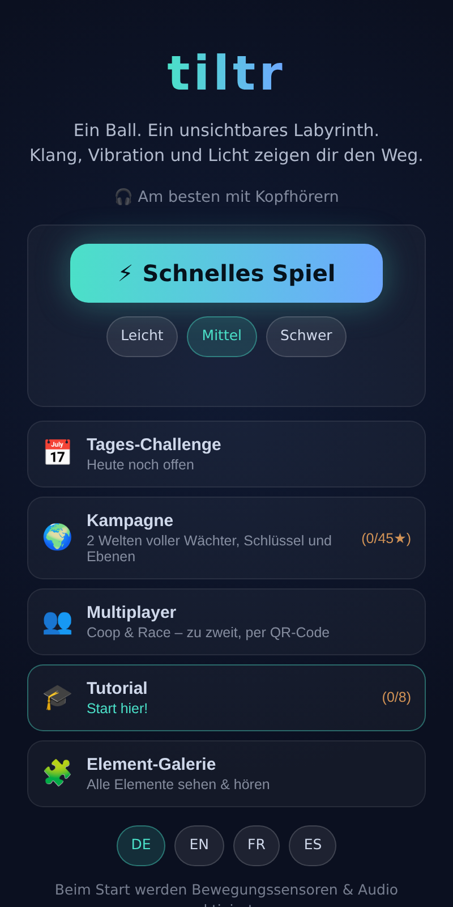

# tiltr – das unsichtbare Labyrinth

🇬🇧 [English version](README.md)

**Ein immersives Sensor-Spiel als PWA.** Du steuerst einen Ball per Neigung
des Handys durch ein unsichtbares Labyrinth – die Welt offenbart sich über
**räumlichen Klang** (Rollen, Wand-Echos, Sonar-Ping des Ziels),
**Vibration** und **sparsames Licht**: Wände leuchten nur dort auf, wo du
sie berührst oder dein Echo-Ping sie erreicht. Am besten mit Kopfhörern und
halb geschlossenen Augen.

**▶ Jetzt spielen: https://d0m1n1kr.github.io/tiltr/** – jeder Push deployt
automatisch per GitHub Actions (Tests → Build → Pages).

| Splash | Menü | Echo-Ping | Multiplayer-Lobby | Coop |
|---|---|---|---|---|
|  |  |  |  |  |

## Spielmodi

- **⚡ Schnelles Spiel** – prozedural generiertes Labyrinth in drei
  Schwierigkeiten, mit Bestzeiten pro Stufe. Höhere Stufen mischen
  Echo-Kristalle, Sog-Anker und Glasböden hinein – Anker und Glas
  beweisbar abseits des Pflichtwegs platziert.
- **📅 Tages-Challenge** – Seed = UTC-Datum: ein Level für alle, jeden Tag
  ein neues, komplett serverlos und reproduzierbar. Der erste Zieleinlauf
  zählt als Tageswert, Serien 🔥 belohnen tägliches Spielen. Share-Links
  (`#daily=DATUM&t=ZEIT`) fordern Freunde heraus, deine Zeit zu schlagen –
  auch für vergangene Tage.
- **🌍 Kampagne** – vier handgebaute Welten (28 Level): Wächter, Schlüssel
  und Türen, Gems, atmende Löcher, Wind, brüchige Wände, mehrstöckige
  Karten mit Transportern und Multi-Screen-Weiten, über die die Kamera
  scrollt. Welt 3 „Das Räderwerk" dreht sich ums Timing: Schiebewände,
  Zeitschloss-Schalter und Einbahn-Strömungen. Welt 4 „Die Stille" ist die
  Schleich-Welt: Horcher, die nur jagen, solange du rollst, Nebel, der
  jeden Klang dämpft, und Eis, über das du gleitest. Bis zu drei Sterne
  pro Level (geschafft, Par-Zeit, alle Gems), dazu ein optionaler
  Blind-Stern 🌑 fürs Durchkommen ohne einen einzigen Echo-Ping – und die
  eigene Bestzeit rollt bei späteren Versuchen als blasser Geist-Schein mit.
- **👥 Multiplayer** – zwei Spieler, Peer-to-Peer über WebRTC
  ([trystero](https://github.com/dmotz/trystero); der Handshake läuft über
  eine feste Liste von 8 etablierten Nostr-Relays, kein eigener Server).
  Beitritt per QR-Code (In-App-Scanner oder Kamera-App – der Code trägt
  einen `#join=`-Link) oder 6-stelligem Raumcode. **Coop:** Druckplatten
  öffnen die Türen des Partners; jede Tür versiegelt eine Kammer mit einer
  Platte außen und einer innen, und wer im Ziel liegt, hält die Zielplatte
  für den Nachzügler – gewonnen ist erst, wenn beide drin sind. **Race:**
  identisches Level, wer zuerst ankommt, gewinnt – mit Rematch. Neben den
  handgebauten Leveln würfelt ein 🎲-Generator frische Coop- und
  Race-Karten – der Gast regeneriert aus der Level-ID exakt dasselbe Level.
  Ein schwacher, atmender Schein zeigt den Partner – reines Licht ohne Rand,
  immer blasser als der eigene Ball, am Screenrand geklemmt, wenn er außer
  Sicht ist, und in Zielgrün, sobald er durch ist. Der Zieleinlauf stoppt
  die UHR, nicht die Kugel: Die Zeit bleibt stehen und wird grün, das
  eigene Ziel leuchtet ruhig weiter, und man rollt weiter – im Coop hält man
  so dem Nachzügler noch die Platten. Bei Verbindungsverlust gibt es ein 10-Sekunden-Fenster
  zum Wiederverbinden.
- **🛠 Werkstatt** – eigene Level im Touch-Editor bauen (auf Tablets als
  Dreispalter): Elemente aus der kompletten Registry platzieren, Wände
  schalten, mehrstöckige Karten mit Transportern bauen, Eigenschaften
  feilen – während die Lösbarkeits-Beweise der Testsuite live als Badges
  mitlaufen (Ziel erreichbar, kein Softlock, Timer reicht …). Jedes gewählte
  Element spielt seine Klang-Signatur direkt im Eigenschaften-Panel, und ▶
  lässt die bewegten Teile laufen (atmende Löcher, Schiebewände,
  patrouillierende Wächter) – so beurteilst du den Rhythmus, ohne den
  Entwurf zu verlassen. Entwürfe in der echten Spielschleife testen und mit
  einem Tap zurückspringen; die
  Bibliothek liegt lokal auf dem Gerät. Fertige Level teilst du über
  einen serverlosen Link (das Level reist deflate-komprimiert im
  URL-Hash – Teilen geht erst, wenn alle Pflicht-Badges grün sind:
  geteilte Level sind beweisbar lösbar) oder als JSON-Datei (Export +
  Import per Datei oder Einfügen).
- **🏁 Geist-Duell** – aus einem Lauf wird eine Herausforderung: Der Link
  trägt Level, aufgezeichnete Spur und Zeit (serverlos im URL-Hash). Wer
  ihn öffnet, rennt gegen die echte Spur – und *hört* den Rivalen räumlich
  neben sich rollen. Schneller? Dann Revanche schicken – das ist der
  Ping-Pong-Loop. Empfangene Spuren werden vorher auf Plausibilität
  geprüft (Start, Ziel, kein Teleport), damit kein 0,1-Sekunden-Phantom
  antritt.
- **🎧 Hörtest** – der Ping kommt aus einer von acht Richtungen, du tippst
  an, woher. Acht Runden, dann ein Urteil, das die beiden Achsen TRENNT:
  links/rechts (stark – echte Ohr-Differenzen) und vorn/hinten (schwach –
  eine generische HRTF trägt fremde Ohren). Gleichzeitig der
  Kopfhörer-Check vor der ersten Runde.
- **🎓 Tutorial** – acht Micro-Level, die die Klangsprache beibringen,
  ein Element nach dem anderen.
- **🧩 Element-Galerie** – lebende Doku: jedes Element mit Visual und
  Klang-Signatur, per Knopfdruck anspielbar.

**Sprachen:** Deutsch, Englisch, Französisch und Spanisch – automatisch
nach Browser-Locale, jederzeit auf dem Startscreen umschaltbar.

## Auf dem Handy spielen

Live-Seite öffnen, einen Modus antippen (aktiviert Bewegungssensoren und
Audio), Kopfhörer aufsetzen und das Handy während des Kalibrier-Countdowns
flach wie ein Tablett halten. HUD-Knöpfe: `⌖` neu kalibrieren, `👁`
Debug-Ansicht (zeigt das Labyrinth), `🏠` zurück zum Menü. Als App
installieren (offline & Vollbild) über den Hinweis oder das Browser-Menü.

Zwei Steuerungen, auf dem Startscreen umschaltbar und gültig für jeden
Modus: **🥣 Draufsicht** (Handy flach wie ein Tablett, Neigen = Rollen) und
**🧭 First Person** (Handy ~45° vor dir wie ein Lenkrad: Kippen = vor/zurück
entlang der Blickrichtung, seitlich neigen = drehen – die Welt dreht sich um
die Kugel, die Blickrichtung zeigt immer nach oben, und das räumliche Audio
dreht mit: „links/rechts von mir" ist genau die Achse, die das Gehör am
besten kann). Geister, Duelle und Multiplayer bleiben voll kompatibel –
jeder wählt seine eigene Steuerung.

Solange ein Lauf oder der Hörtest läuft, bleibt der Bildschirm wach
(Screen Wake Lock) – gesteuert wird durch Neigen, das Handy würde sonst
mitten im Level abdunkeln und sperren. Chromium-Browser (Android Chrome,
Edge, Desktop-Chrome) unterstützen das; iOS/Safari bringt die API nicht
mit, dort greift weiter die System-Zeitschaltung.

Am Desktop gibt es einen Tastatur-Fallback: Pfeiltasten/WASD zum Rollen,
Leertaste für den Ping.

## Spielelemente

| Element | Signatur |
|---|---|
| Neigungssteuerung | `DeviceOrientationEvent`, Kalibrier-Countdown nach Start-Tap, Achsen-Remap nach Screen-Orientierung, Tastatur-Fallback |
| Spatial Audio | HRTF-`PannerNode`: alle Richtungsklänge räumlich (Kopfhörer!) |
| Wände | Echo: berührte Wände leuchten kurz auf; brüchige Wände (bernstein) knirschen und stürzen nach 3 Treffern ein |
| Löcher | atmen (öffnen/schließen zyklisch, versetzt); offen = Sog + dunkles Grollen + Herzschlag, zu = harmlos |
| Windzonen | konstante Windkraft, hörbar als Böen-Rauschen aus Richtung der Zone |
| Checkpoints | auf dem Lösungsweg (BFS); Respawn-Punkt, +1 Echo-Ping |
| Echo-Ping | Tap/Leertaste: Wellenfront deckt Umgebung auf, Reflexionen kommen entfernungs-verzögert & räumlich zurück; Durchgänge antworten hell & doppelt, Gems kristallklar, Türen dumpf; begrenzter Vorrat |
| Wächter | patrouilliert (Ping-Pong über Wegpunkte), pulsierendes Brummen aus seiner Richtung; Berührung = zurück zum Checkpoint |
| Schlüssel & Tür | Schlüssel klimpert in Hörweite, Einsammeln lässt die Tür hörbar aufgleiten |
| Gems | optionale Sammelkristalle mit eigener Ping-Antwort; alle gesammelt = dritter Stern |
| Transporter | trägt den Ball auf andere Ebenen (oder als Portal quer über die Map); schwebender Doppelton in der Nähe, Warp klingt abwärts fallend bzw. aufwärts steigend; Ziel-Beacon klingt auf fremden Ebenen gedämpft wie durch den Boden |
| Schiebewand | schiebt sich im Takt auf und zu – nur voll geöffnet passierbar; rhythmisches Steinschleifen plus beschleunigender Warn-Takt kurz vorm Schließen |
| Zeitschloss-Schalter | Betreten öffnet die verknüpfte Tür für ein paar Sekunden; ein Tick-Tock zählt herunter und wird hektisch, wenn die Zeit knapp wird |
| Strömung | schiebt stärker, als man neigen kann – eine Einbahnstraße; pulsierendes, gerichtetes Rauschen, tiefer und drängender als Wind |
| Horcher | jagt dich, solange du rollst – er hört dich sogar durch Wände; stehst du still, zieht er sich zurück; Schnüffeln schwillt mit deinem Tempo an |
| Nebelzone | dämpft ALLE Klänge (auch den Ziel-Sonar) über einen globalen Lowpass; kein Physik-Einfluss – sie nimmt dir nur die Ohren |
| Eisfläche | reibungsarmer Boden: du gleitest weiter, Bremsen und Lenken werden schwammig; kristallines Sirren unter dem Ball |
| Echo-Kristall | abgefüllter Ping: Einsammeln gibt +1 Echo-Ping, auch über das Rundenbudget hinaus; heller einzelner Glockenton |
| Sog-Anker | zieht im Radius an – immer überwindbar (Kraft bleibt unter voller Neigung), kostet aber Zeit; elektrisches Brummen schwillt mit der Nähe an |
| Glasboden | erstes Überrollen knackt warnend, das zweite zersplittert ihn zum offenen Loch; helles Knacken, dann Splittern |
| Blind-Stern 🌑 | optionaler vierter Stern pro Kampagnen-Level: geschafft ohne einen einzigen Echo-Ping |
| Geist-Replay | die eigene Bestzeit pro Level rollt als blasser Schein mit (Schnelles Spiel, Daily, Kampagne); lokal gespeichert, nur ein schnellerer Lauf ersetzt sie |
| Druckplatte | Multiplayer-Element: gehalten öffnet sie die verknüpfte Partnertür – Loslassen schließt sie; Klick beim Betreten, Tür gleitet hörbar |
| Partner-Schein | weiches, atmendes Licht an der Position des Mitspielers – kein Rand, kein Körper (der einzige feste Körper ist der eigene Ball); außer Sicht an den Screenrand geklemmt (mit Ebenen-Label), in Zielgrün sobald er im Ziel war |
| Ziel-Beacon | Sonar-Ping: näher = schneller, lauter, höher |

## Entwicklung

TypeScript + Vite + Vitest + Playwright; PWA über `vite-plugin-pwa`. Der
Ausbauplan steht in [`docs/PLAN.md`](docs/PLAN.md), die verbindliche
UI-Guideline in [`docs/DESIGN.md`](docs/DESIGN.md); der ursprüngliche
Phase-0-Prototyp liegt als Referenz in [`prototype/`](prototype/).

```bash
npm install
npm run dev        # Dev-Server (Desktop: Pfeiltasten/WASD, Leertaste = Ping)
npm run typecheck  # tsc --noEmit
npm test           # Vitest-Units (Physik, Maze, Level-Lösbarkeit, i18n)
npm run lint       # ESLint
npm run build      # Produktions-Build nach dist/ (inkl. Service Worker)
npm run e2e        # Playwright-Smoke gegen vite preview (fester Seed)
```

Nützliche URL-Parameter: `?seed=<zahl|text>` macht Läufe reproduzierbar,
`?unlock` schaltet alle Kampagnen-Level frei (Playtesting), `?nosplash`
überspringt den Splash (E2E), `?mpcode=TEST…` erzwingt einen Raumcode auf
dem lokalen `BroadcastChannel`-Transport (Multiplayer-E2E ohne Netz).

Test-Philosophie: Jedes Level kommt mit Lösbarkeits-Beweis (BFS über
Ebenen, gerichtete Transporter-Kanten, Tür-/Schlüssel-/Platten-Fixpunkte –
die Coop-Tests beweisen sogar, dass jede Tür notwendig ist und niemand
eingesperrt werden kann), die vier Sprach-Wörterbücher werden auf
Vollständigkeit erzwungen, und ein Safe-Area-Pflichtlauf spielt die in der
installierten PWA wirksamen Insets nach, die im Browser unsichtbar sind.
Fürs Testen am Handy braucht es HTTPS: am einfachsten die Live-Seite,
sonst `npx vite --host` mit lokalem TLS-Plugin oder einem Tunnel.

## Roadmap

M1 Fundament ✓ → M2 Element-Registry + Levelformat ✓ → M3 Tutorial &
Schnelles Spiel ✓ → M4 Kampagne Welt 1 ✓ → M5 Ebenen/Transporter + Welt 2 ✓
→ M6 Tages-Challenge + Herausfordern ✓ → M7 Multiplayer Coop & Race ✓ →
M8 Design-Politur, Splash & i18n (DE/EN/FR/ES) ✓ → **1.0** 🎉 →
M9 Welt 3 „Das Räderwerk" (Schiebewände, Zeitschlösser, Strömungen) +
Geist-Replay ✓ → M10 Welt 4 „Die Stille" (Horcher, Nebel, Eis) +
Blind-Stern ✓ → M11 Echo-Kristall, Sog-Anker, Glasboden +
Generator-Integration ✓ → M12a Werkstatt: Level-Editor mit
Live-Lösbarkeits-Beweisen, Bibliothek & Spiel-Preview ✓ → M12b Teilen:
serverlose Level-Links, JSON-Import/-Export, Mehr-Ebenen-Editor ✓

---

Ein Spiel von **Dominik Rössler & Claude**.
