# tiltr — the invisible maze

🇩🇪 [Deutsche Version](README.de.md)

**An immersive sensor game as a PWA.** You steer a ball through an invisible
maze by tilting your phone. The world reveals itself through **spatial
sound** (rolling, wall echoes, the goal's sonar ping), **vibration** and
**sparse light**: walls only flash where you touch them or where your echo
ping reaches. Best played with headphones, eyes half closed.

**▶ Play now: https://d0m1n1kr.github.io/tiltr/** — installable as an app,
works offline. Every push deploys automatically (tests → build → GitHub
Pages). The start screen has a **📣 Spread the word** button: one message with a
short pitch in your language and this link – whose preview carries the
animation below.

<p align="center">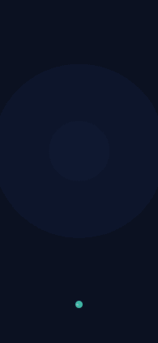</p>

| Splash | Menu | Echo ping | Campaign |
|---|---|---|---|
| 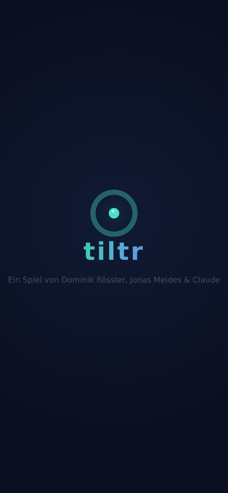 | 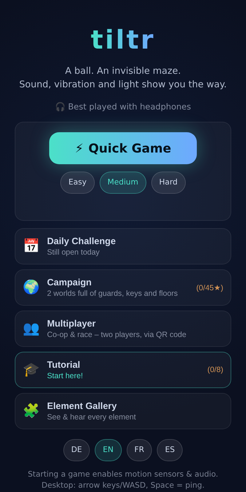 | 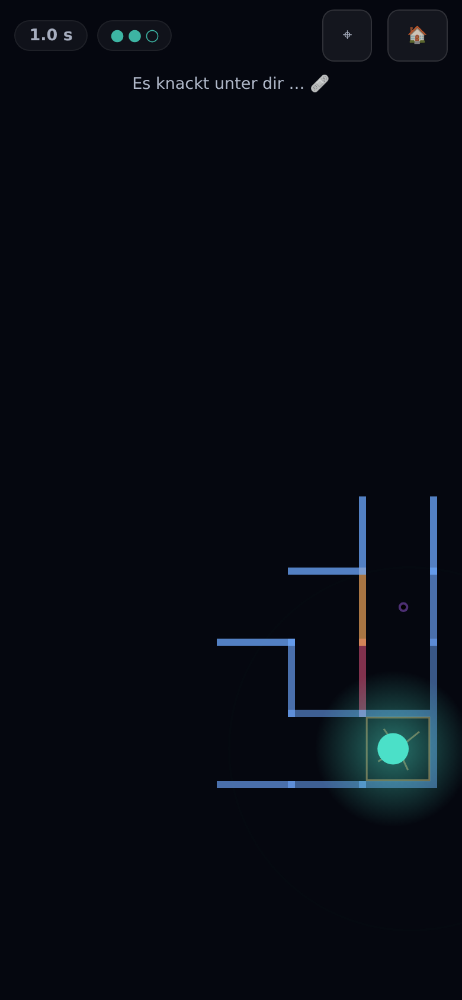 | 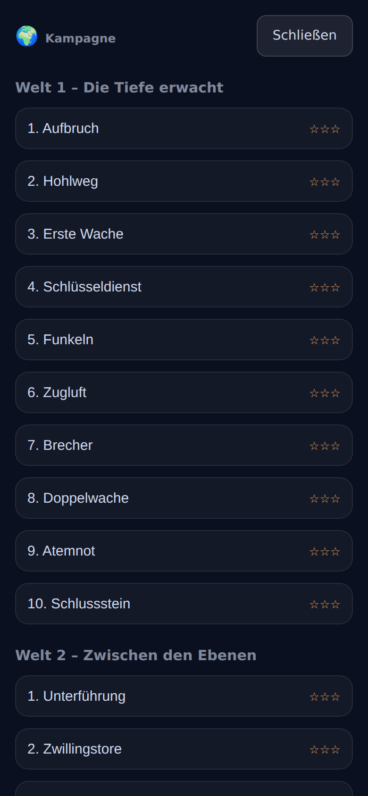 |

| Level done | Tutorial | Hearing test | Element gallery |
|---|---|---|---|
| 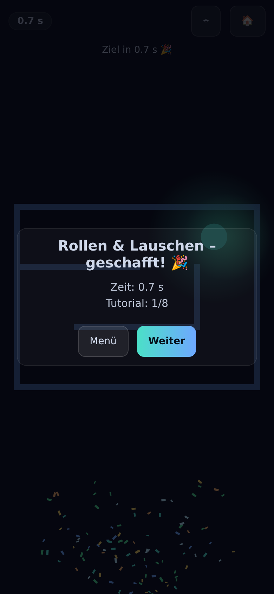 | 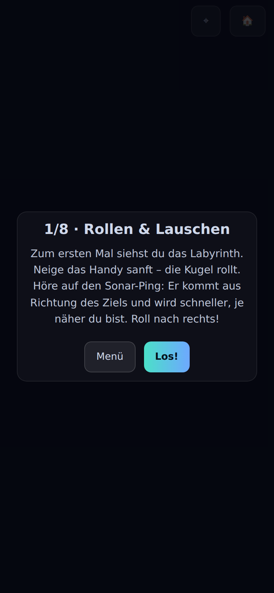 | 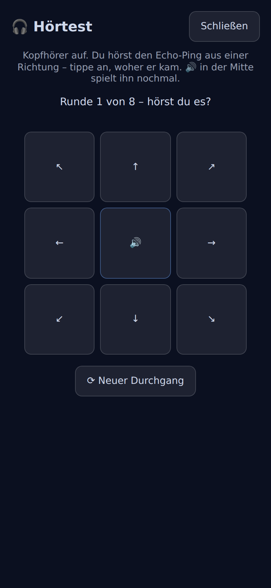 | 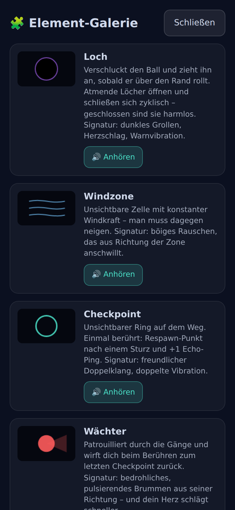 |

| Multiplayer lobby | Co-op in the dark | Co-op in the light | Two-player intro |
|---|---|---|---|
| 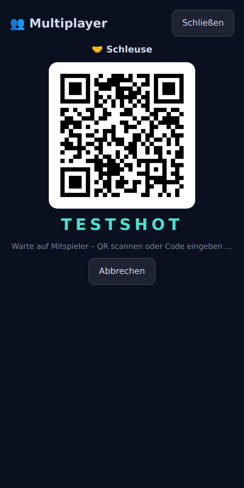 | 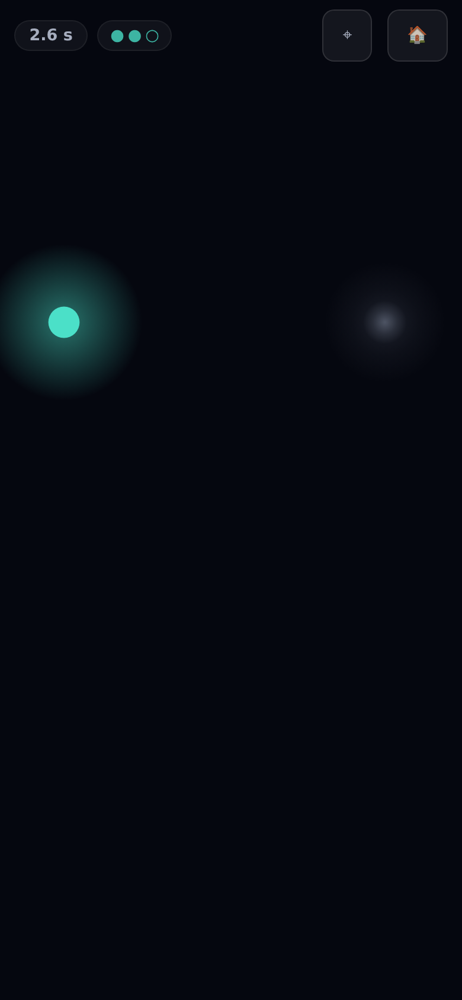 | 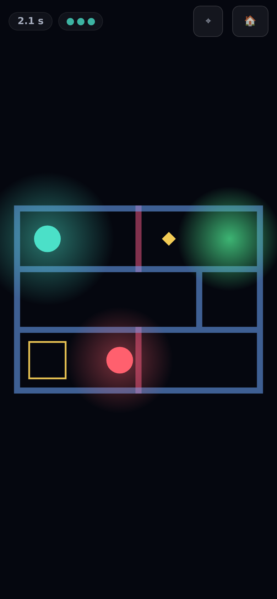 | 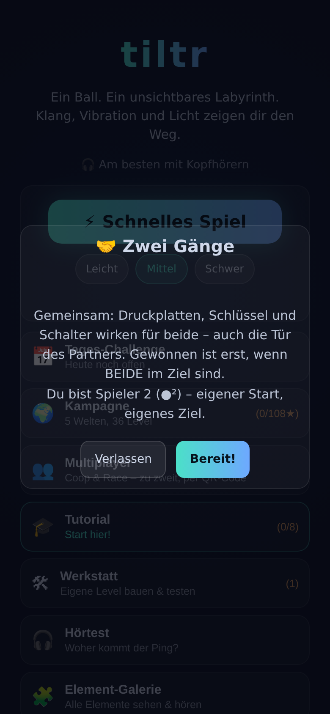 |

| Workshop | Editor (phone) | Editor (tablet) | Two-player test mode |
|---|---|---|---|
| 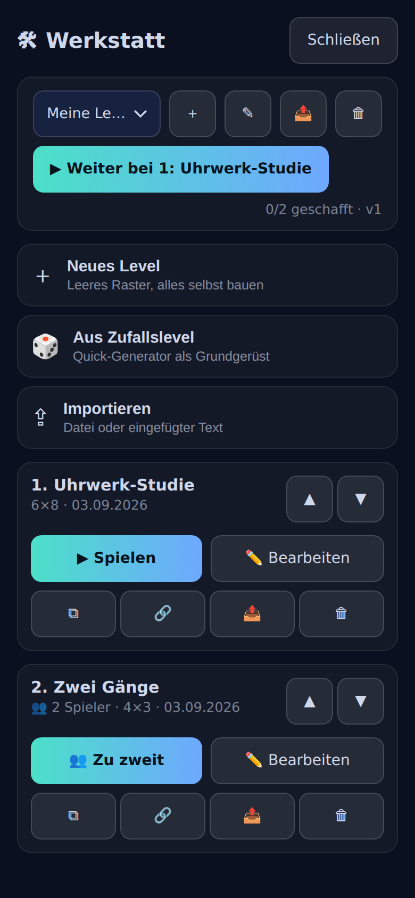 | 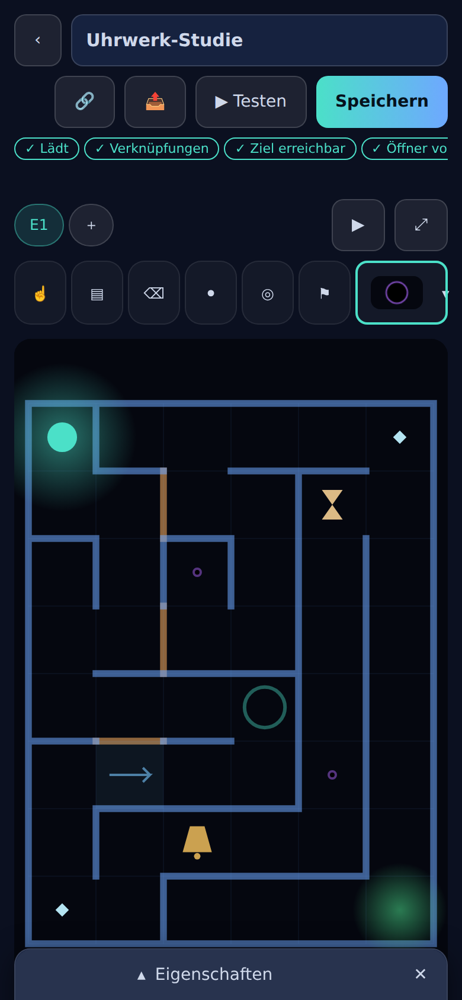 | 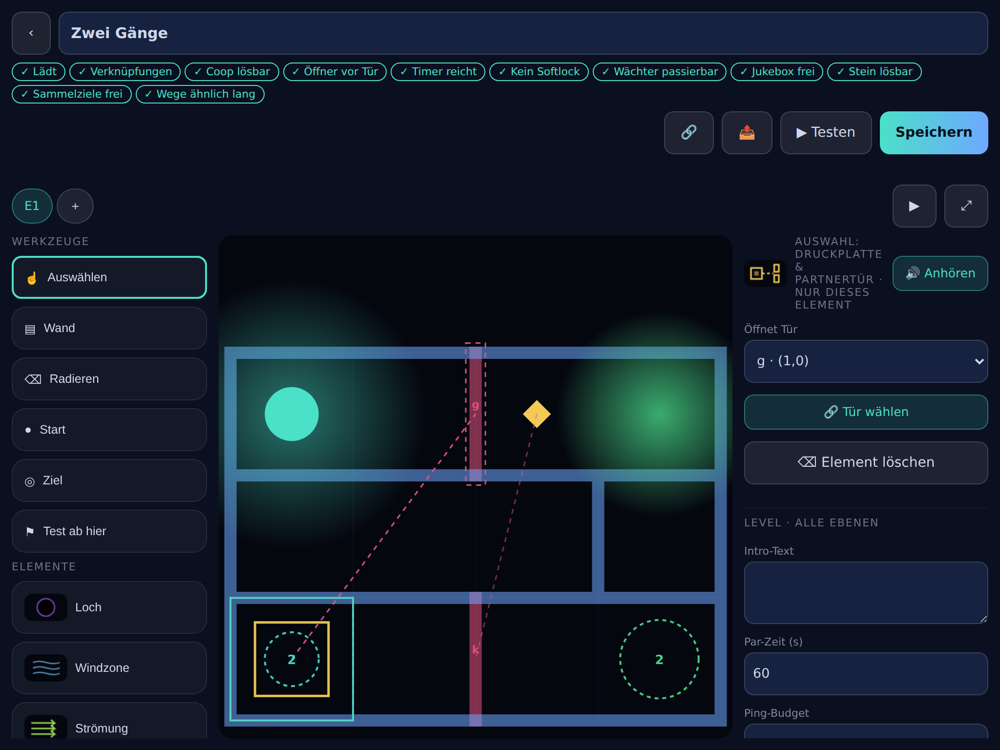 | 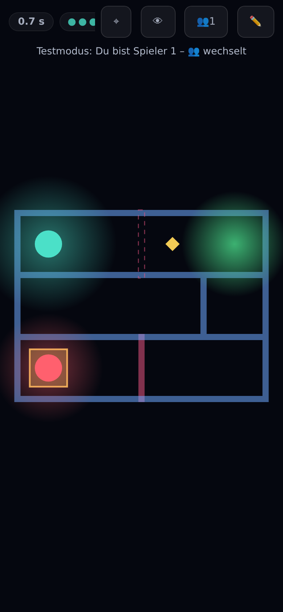 |

## Game modes

- **⚡ Quick Game** — a procedurally generated maze in three difficulties
  with best times per difficulty. Harder presets add floors, bright floors,
  door puzzles (key plus time lock), echo crystals, pull anchors and glass,
  all placed provably off the required path.
- **📅 Daily Challenge** — seed = UTC date: one level for everyone, a new
  one every day, serverless and reproducible. Your first finish is the
  daily score, streaks 🔥 reward playing daily. `#daily=DATE&t=TIME` links
  challenge friends to beat your time, for past days too.
- **🌍 Campaign** — five hand-built worlds, 36 levels. World 1 teaches
  guards, keys and doors, gems, breathing holes, wind and brittle walls;
  World 2 goes multi-floor with transporters and screen-scrolling expanses;
  World 3 "The Clockwork" is timing (sliding walls, time locks, one-way
  currents); World 4 "The Silence" is stealth (listeners, fog, ice); World 5
  "Mirage" turns the senses around (bright floors, echo mirrors, sound-proof
  walls, decoy bells, a reverb hall, a tuning-fork key, boulders, a sleeping
  guard). Up to three stars per level (finish, par time — extendable with
  hourglasses — and all gems) plus a blind star 🌑 for finishing without a
  single ping. Your best run rolls along as a faint ghost. The tutorial
  starts in the light: the first room is lit, the second is the same room in
  the dark.
- **👥 Multiplayer** — two players, peer-to-peer over WebRTC
  ([trystero](https://github.com/dmotz/trystero) over a fixed list of Nostr
  relays, no server of our own). Join via QR code, 6-letter room code or the
  host's **📨 invite** (message plus join link through the share sheet).
  **Co-op:** pressure plates, keys and switches work for both of you, so
  you can open your partner's doors; you win once both are in — and a level
  can ask you to **arrive together**, meaning both of you in your goals at the
  same moment (whoever gets there first waits, and the straggler hears the
  call). **Race:**
  identical level, first one in wins, with rematch. Seven hand-built co-op
  levels, six race levels plus a 🎲 generator, and every **two-player level from the workshop**
  can be hosted straight from your library — the guest receives it with the
  room. In co-op you **hear** your partner: a warm low hum from his
  direction, plus a rolling layer that grows with his speed — a wall of felt
  muffles him, another floor leaves a distant rumble. In race he stays
  silent; there the blindness is the race. He is also a faint shimmer in the
  dark and a solid red ball on bright floors. Reaching the goal stops your
  clock, not your ball, so you can keep holding plates for the straggler. Lost connections get a
  10-second reconnect window; the lobby keeps the screen awake, says when no
  signaling relay is reachable, and can rebuild the connection (**🔄
  Reconnect**) without changing the room code. If a network forbids direct
  connections altogether — mobile data behind carrier NAT, guest Wi-Fi with
  client isolation — the handshake succeeds and the media path never opens;
  the lobby says so instead of waiting forever and offers a **TURN relay**
  field (`turn:host:3478|user|password`, or your provider's JSON). It is
  stored on the device only, and a built-in self-test reports whether that
  relay actually answers.
- **🛠 Workshop** — a touch-first level editor (three panes on tablets).
  Place any element from the registry, toggle walls and wall variants,
  build multi-floor maps with transporters, and watch the solvability
  proofs run live as badges: goal reachable, openers before their doors,
  timers long enough, no softlock, guards passable, boulder puzzle solvable.
  Switch a level to **two players** for an own start and goal for the guest,
  pressure plates and co-op/race proofs — plus a **test mode for one**: the
  preview loads both balls, 👥 switches player, and the other one stays where
  you left it (still holding its plate). Levels live in **bundles** that play
  like a campaign with saved progress and export as one file. Test a draft in
  the real game loop, share finished levels as a serverless link (the level
  travels compressed in the URL) or as JSON. A level with failing badges
  shares too, after a confirmation – as a diagnostic link that warns the
  recipient, and the export file then carries the findings, so someone else
  can look at what the proof objects to. **💾 Back up** saves progress, best times, workshop and
  ghosts to one file that **📂** restores.
- **🏁 Ghost duel** — turn a finished run into a challenge link that carries
  the level, your trace and your time. Whoever opens it races the real trace
  and *hears* the rival rolling beside them. Beat the time and send a
  rematch.
- **🎧 Hearing test** — the ping comes from one of eight directions, you tap
  where you heard it. The verdict splits left/right (strong) from front/back
  (weak with a generic HRTF). A headphone check before the first run.
- **🎓 Tutorial** — eight micro-levels that teach the sound language, one
  element at a time. Elements that appear for the first time light up for a
  few seconds and play their signature.
- **🧩 Element gallery** — every element with its visual and its sound,
  playable at a tap.

Every finished level is celebrated with confetti in the world's palette and a
burst of paper sound (`prefers-reduced-motion` skips the confetti).
**Languages:** English, German, French and Spanish, auto-detected and
switchable on the start screen.

## Playing on your phone

Open the live page, tap a mode (this enables motion sensors and audio), put
on headphones and hold the phone as announced during the calibration
countdown. HUD buttons: `⌖` recalibrate, `🏠` menu; `👁` (debug view) appears
after five taps on the version number. Install it as an app via the install
hint or the browser menu.

Two control schemes, switchable on the start screen: **🥣 Top-down** (hold
the phone flat like a tray) and **🧭 First person** (hold it at ~45° like a
steering wheel: tip forward to roll, lean sideways to turn — the world and the
spatial audio rotate around your ball). Ghosts, duels and multiplayer stay
compatible; each player picks their own scheme. The screen stays awake during
runs where the browser supports the Screen Wake Lock (Chromium; iOS does not
expose it). On desktop: arrow keys/WASD roll, Space pings.

## Game elements

| Element | Signature |
|---|---|
| Tilt control | `DeviceOrientationEvent`, calibration after the start tap, axis remap by screen orientation (measured on iPhone and iPad), keyboard fallback |
| Spatial audio | HRTF `PannerNode`: every directional sound is positional; every echo has a broadband onset so the ear can place it |
| Walls | touched walls flash; brittle walls (amber) collapse after 3 hits; sound-proof walls (khaki) swallow the ping and muffle everything behind them; echo mirrors answer from twice the distance |
| Holes | breathe in offset cycles; open = pull, rumble and heartbeat; roaming holes patrol like guards |
| Wind zone / current | wind pushes, audible as gusts; a current pushes harder than you can tilt — a one-way street |
| Checkpoint | respawn point plus one echo ping; transporter landings respawn too |
| Echo ping | a wavefront reveals the surroundings; reflections return delayed and placed in space; limited per level, refilled by echo crystals |
| Guard / sleeper | patrols a route of any length with a pulsing hum, pausing at waypoints you set; touch sends you back. A sleeper snores on its post until your ping wakes it |
| Key & door | the key jingles within earshot; a tuning-fork key hums an ungpanned tone you locate by pitch. Doors take one or all of their openers, can be restricted to one player — for the other one it is simply a wall — and either close again once the plate is released or stay open for good |
| Pressure plate | held, it opens the linked door — by you, your partner or a boulder |
| Time-lock switch | opens its door for a few seconds with a tick-tock that turns frantic |
| Sliding wall | grinds open and shut to a beat, warning tick before it closes |
| Gems & hourglass | gems for the third star; hourglasses extend the par time |
| Transporter | carries the ball to other floors or across the map; hovering double tone, warp rises or falls in pitch |
| Listener | hunts you while you roll, even through walls; stand still and it withdraws. Decoy bells lure it away; sound-proof walls give cover |
| Fog / reverb hall | fog muffles everything through one lowpass; the hall adds a long tail to every sound |
| Ice | you keep gliding, braking turns mushy; crystalline whirring |
| Pull anchor / glass | the anchor drags you but never traps you; glass cracks on the first pass and breaks on the second |
| Boulder | a second body you push cell by cell: fills holes, holds plates, keeps rolling on ice |
| Jukebox | a solid music box playing 8-bit themes (public-domain classics from scored sources plus originals); music masks the echoes, bumping it skips a track |
| Bright floor / dusk | a lit floor you can see; dusk stays lit until your first wall touch, then fades |
| Partner | a warm hum from his direction plus his rolling (co-op only); a breathing shimmer in the dark, a red ball on bright floors, clamped to the screen edge when out of view |
| Goal beacon | sonar ping: closer = faster, louder, higher |

## Development

TypeScript + Vite + Vitest + Playwright; PWA via `vite-plugin-pwa`. The
design log lives in [`docs/PLAN.md`](docs/PLAN.md), the binding UI guideline
in [`docs/DESIGN.md`](docs/DESIGN.md), agent notes in
[`CLAUDE.md`](CLAUDE.md); the phase-0 prototype is kept in
[`prototype/`](prototype/).

```bash
npm install
npm run dev          # dev server (desktop: arrows/WASD, Space = ping)
npm run typecheck    # tsc --noEmit
npm test             # Vitest units (physics, mazes, level proofs, i18n)
npm run lint         # ESLint
npm run build        # production build to dist/ (incl. service worker)
npm run e2e          # Playwright smoke, 4 workers against vite preview
npm run screenshots  # regenerate docs/screenshots/ from the built app
```

URL parameters: `?seed=…` makes runs reproducible, `?unlock` opens all
campaign levels, `?nosplash` skips the splash, `?debug` enables the debug
view and sensor diagnostics, `?netdebug` shows the multiplayer lobby's relay
diagnostics, `?mpcode=TEST…` forces a room code onto the local
`BroadcastChannel` transport (multiplayer without network).

Testing philosophy: every level ships with a solvability proof (BFS across
floors, directed transporter edges, door/key/plate fixpoints, guard
patrols, boulder states; two-player levels prove both players reach their
goal), the same proofs power the editor badges, the four dictionaries are
enforced to be complete, and a mandatory safe-area run replays installed-PWA
insets that are invisible in the browser. Phone testing needs HTTPS: easiest
via the live page.

---

A game by **Dominik Rössler, Jonas Meides & Claude**.

## License

The **source code** is licensed under the
[PolyForm Noncommercial License 1.0.0](LICENSE): noncommercial use,
modification and redistribution are permitted; **commercial use requires a
separate agreement** with the copyright holder. **Level content, music
notation and documentation** are licensed under
[CC BY-NC-SA 4.0](LICENSE-CONTENT). Commercial inquiries: open an issue on
GitHub.
